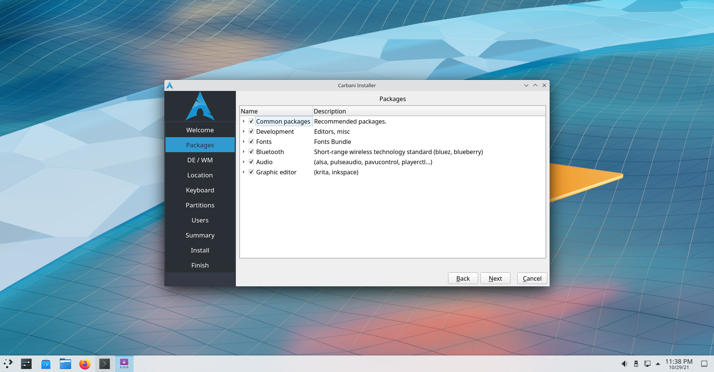

# Carbani Installer

[wiki](https://github.com/joaopedroaa/arch/wiki)

### Download iso
- [github](https://github.com/joaopedroaats/arch/releases/)

#### Pre-installed
- base
- base-devel
- lightdm
- networkmanager
- nvidia
- nvidia-utils
- nvidia-settings
